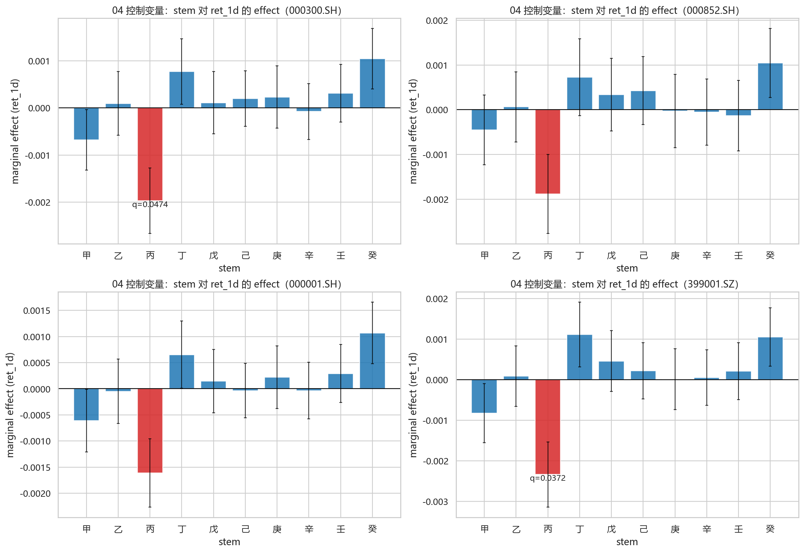
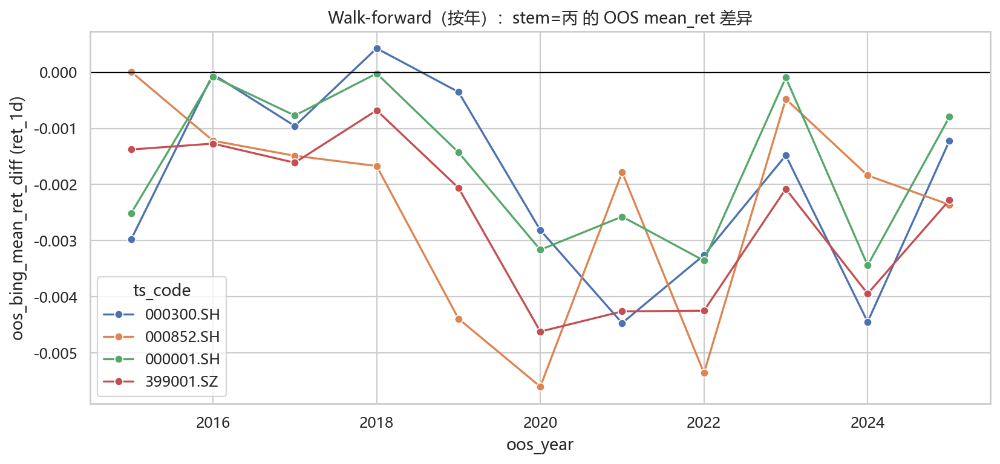

# 流日干支对 A 股涨跌的影响：一键结论报告

- 生成时间：`20260214_005335`
- 样本指数：`000300.SH, 000852.SH, 000001.SH, 399001.SZ`
- 显著性阈值：`q <= 0.1`（BH-FDR）

## 关键结论（简版）
- 控制变量回归（04，stem×ret_1d）在 q_effect<= 0.1 下出现信号：000300.SH:丙，399001.SZ:丙

## 数据覆盖
| ts_code | n_days | start_date | end_date | mean_ret_1d | std_ret_1d | p_up |
| --- | --- | --- | --- | --- | --- | --- |
| 000001.SH | 3916 | 2010-01-04 | 2026-02-13 | 0.000134158 | 0.0124568 | 0.522983 |
| 000300.SH | 3916 | 2010-01-04 | 2026-02-13 | 0.000160807 | 0.0136072 | 0.509448 |
| 000852.SH | 3916 | 2010-01-04 | 2026-02-13 | 0.000303987 | 0.0169241 | 0.544944 |
| 399001.SZ | 3916 | 2010-01-04 | 2026-02-13 | 0.000128748 | 0.015546 | 0.500255 |

### 干支日历分布（交易日，sanity check）
| stem | n_days | share |
| --- | --- | --- |
| 甲 | 394 | 0.100613 |
| 乙 | 396 | 0.101124 |
| 丙 | 395 | 0.100868 |
| 丁 | 389 | 0.0993361 |
| 戊 | 390 | 0.0995914 |
| 己 | 392 | 0.100102 |
| 庚 | 389 | 0.0993361 |
| 辛 | 395 | 0.100868 |
| 壬 | 389 | 0.0993361 |
| 癸 | 387 | 0.0988253 |

| branch | n_days | share |
| --- | --- | --- |
| 子 | 325 | 0.0829928 |
| 丑 | 328 | 0.0837589 |
| 寅 | 330 | 0.0842697 |
| 卯 | 332 | 0.0847804 |
| 辰 | 333 | 0.0850358 |
| 巳 | 327 | 0.0835036 |
| 午 | 326 | 0.0832482 |
| 未 | 323 | 0.0824821 |
| 申 | 317 | 0.0809499 |
| 酉 | 325 | 0.0829928 |
| 戌 | 326 | 0.0832482 |
| 亥 | 324 | 0.0827375 |

## 一页结论表（stem=丙）
| ts_code | n_days | start_date | end_date | effect_bing_minus_all | q_value | effect_bing_minus_all_controls | q_value_effect_controls | p_empirical | wf_neg_ratio | wf_p_value_sign_test |
| --- | --- | --- | --- | --- | --- | --- | --- | --- | --- | --- |
| 000001.SH | 3916 | 2010-01-04 | 2026-02-13 | -0.00162579 | 0.125633 | -0.00161259 | 0.135686 | 0.0679321 | 1 | 0.000976562 |
| 000300.SH | 3916 | 2010-01-04 | 2026-02-13 | -0.00197894 | 0.0456059 | -0.00197054 | 0.0473757 | 0.033966 | 0.909091 | 0.0117188 |
| 000852.SH | 3916 | 2010-01-04 | 2026-02-13 | -0.00192142 | 0.274893 | -0.00188421 | 0.331377 | 0.170829 | 0.909091 | 0.0117188 |
| 399001.SZ | 3916 | 2010-01-04 | 2026-02-13 | -0.00235634 | 0.0317262 | -0.00233952 | 0.0371533 | 0.024975 | 1 | 0.000976562 |

## 主分析（03：无控制变量）
- 图：`main_stem_mean_ret_effect_20260214_005335.png`

显著项（q<=阈值；若为空表示未通过阈值）：
| ts_code | group_value | effect | p_value | q_value | n |
| --- | --- | --- | --- | --- | --- |
| 000300.SH | 丙 | -0.00197894 | 0.00456059 | 0.0456059 | 395 |
| 399001.SZ | 丙 | -0.00235634 | 0.00317262 | 0.0317262 | 395 |

全量扫描（每个 group_type×metric 的最小 q；不代表通过阈值）：
| ts_code | group_type | metric | group_value | effect | p_value | q_value | n |
| --- | --- | --- | --- | --- | --- | --- | --- |
| 000001.SH | branch | mean_ret | 辰 | -0.00163287 | 0.0176208 | 0.211449 | 333 |
| 000001.SH | ganzhi_day | mean_ret | 壬子 | 0.00406768 | 0.00475419 | 0.153765 | 66 |
| 000001.SH | stem | mean_ret | 丙 | -0.00162579 | 0.0125633 | 0.125633 | 395 |
| 000001.SH | branch | p_up | 午 | -0.05059 | 0.0758694 | 0.79712 | 326 |
| 000001.SH | ganzhi_day | p_up | 丁亥 | 0.148892 | 0.0174579 | 0.773858 | 64 |
| 000001.SH | stem | p_up | 癸 | 0.0635807 | 0.0126135 | 0.126135 | 387 |
| 000300.SH | branch | mean_ret | 辰 | -0.0014588 | 0.0452045 | 0.422073 | 333 |
| 000300.SH | ganzhi_day | mean_ret | 壬子 | 0.00493667 | 0.00268869 | 0.161321 | 66 |
| 000300.SH | stem | mean_ret | 丙 | -0.00197894 | 0.00456059 | 0.0456059 | 395 |
| 000300.SH | branch | p_up | 午 | -0.0493257 | 0.0764474 | 0.815294 | 326 |
| 000300.SH | ganzhi_day | p_up | 丁亥 | 0.178052 | 0.00553192 | 0.331915 | 64 |
| 000300.SH | stem | p_up | 癸 | 0.0461071 | 0.0750636 | 0.636051 | 387 |
| 000852.SH | branch | mean_ret | 辰 | -0.00165377 | 0.0697612 | 0.575397 | 333 |
| 000852.SH | ganzhi_day | mean_ret | 庚子 | 0.00611922 | 0.0046214 | 0.277284 | 62 |
| 000852.SH | stem | mean_ret | 丙 | -0.00192142 | 0.0274893 | 0.274893 | 395 |
| 000852.SH | branch | p_up | 午 | -0.0449438 | 0.106919 | 0.559709 | 326 |
| 000852.SH | ganzhi_day | p_up | 壬寅 | 0.171474 | 0.00464958 | 0.268099 | 67 |
| 000852.SH | stem | p_up | 癸 | 0.0467874 | 0.0662185 | 0.662185 | 387 |
| 399001.SZ | branch | mean_ret | 辰 | -0.00159473 | 0.0513616 | 0.566985 | 333 |
| 399001.SZ | ganzhi_day | mean_ret | 壬子 | 0.0051202 | 0.00523457 | 0.286066 | 66 |
| 399001.SZ | stem | mean_ret | 丙 | -0.00235634 | 0.00317262 | 0.0317262 | 395 |
| 399001.SZ | branch | p_up | 辰 | -0.0317869 | 0.250269 | 0.946916 | 333 |
| 399001.SZ | ganzhi_day | p_up | 壬寅 | 0.12661 | 0.0498021 | 0.897719 | 67 |
| 399001.SZ | stem | p_up | 丁 | 0.0370197 | 0.155639 | 0.600396 | 389 |

通过阈值的项（q<=阈值）：
| ts_code | group_type | metric | group_value | effect | p_value | q_value | n |
| --- | --- | --- | --- | --- | --- | --- | --- |
| 000300.SH | stem | mean_ret | 丙 | -0.00197894 | 0.00456059 | 0.0456059 | 395 |
| 399001.SZ | stem | mean_ret | 丙 | -0.00235634 | 0.00317262 | 0.0317262 | 395 |

## 稳健性（04）
### 04a 控制变量回归（weekday/month/year）
- 图：`controls_stem_ret_1d_effect_20260214_005335.png`

显著项（q_effect<=阈值；若为空表示未通过阈值）：
| ts_code | group_value | effect | p_value_effect | q_value_effect |
| --- | --- | --- | --- | --- |
| 000300.SH | 丙 | -0.00197054 | 0.00473757 | 0.0473757 |
| 399001.SZ | 丙 | -0.00233952 | 0.00371533 | 0.0371533 |

### 04b 子样本（年份段）
- 图：`subsample_bing_effect_bp_20260214_005335.png`

### 04c 置换检验（全局）
> p_empirical 越小表示“存在任意组效应”的证据越强。
| group_col | target | k_groups | t_obs | p_empirical | t_perm_mean | t_perm_p95 | t_perm_p99 | ts_code | n |
| --- | --- | --- | --- | --- | --- | --- | --- | --- | --- |
| stem | ret_1d | 10 | 0.00235634 | 0.024975 | 0.00141042 | 0.00211243 | 0.00260723 | 399001.SZ | 3916 |
| stem | ret_1d | 10 | 0.00197894 | 0.033966 | 0.00124018 | 0.00186038 | 0.00221082 | 000300.SH | 3916 |
| stem | ret_1d | 10 | 0.00162579 | 0.0679321 | 0.00113558 | 0.00168616 | 0.0020473 | 000001.SH | 3916 |
| stem | up | 10 | 0.0635807 | 0.0699301 | 0.0444643 | 0.0669106 | 0.0811353 | 000001.SH | 3916 |
| branch | ret_1d | 12 | 0.00163287 | 0.151848 | 0.00128392 | 0.0018607 | 0.00214632 | 000001.SH | 3916 |
| stem | ret_1d | 10 | 0.00192142 | 0.170829 | 0.00152815 | 0.00228005 | 0.00284558 | 000852.SH | 3916 |
| ganzhi_day | up | 60 | 0.178052 | 0.181818 | 0.157112 | 0.200249 | 0.223779 | 000300.SH | 3916 |
| ganzhi_day | ret_1d | 60 | 0.00611922 | 0.188811 | 0.0054015 | 0.00709203 | 0.00773887 | 000852.SH | 3916 |
| ganzhi_day | ret_1d | 60 | 0.00493667 | 0.1998 | 0.00436669 | 0.00573665 | 0.00663752 | 000300.SH | 3916 |
| ganzhi_day | ret_1d | 60 | 0.00439625 | 0.254745 | 0.00401153 | 0.00531688 | 0.00592349 | 000001.SH | 3916 |
| ganzhi_day | up | 60 | 0.171474 | 0.266733 | 0.156877 | 0.201194 | 0.221443 | 000852.SH | 3916 |
| ganzhi_day | ret_1d | 60 | 0.00527911 | 0.31968 | 0.00499144 | 0.00660502 | 0.00729714 | 399001.SZ | 3916 |
| stem | up | 10 | 0.0467874 | 0.396603 | 0.044768 | 0.0664794 | 0.0823086 | 000852.SH | 3916 |
| branch | ret_1d | 12 | 0.0014588 | 0.40959 | 0.00140085 | 0.00205594 | 0.00237506 | 000300.SH | 3916 |
| stem | up | 10 | 0.0461071 | 0.412587 | 0.0448148 | 0.0689578 | 0.0778934 | 000300.SH | 3916 |
| branch | up | 12 | 0.05059 | 0.456543 | 0.0504682 | 0.0733476 | 0.0874023 | 000001.SH | 3916 |
| branch | ret_1d | 12 | 0.00159473 | 0.487512 | 0.00159455 | 0.00229933 | 0.00272028 | 399001.SZ | 3916 |
| branch | up | 12 | 0.0493257 | 0.502498 | 0.05074 | 0.0738656 | 0.0866089 | 000300.SH | 3916 |
| branch | ret_1d | 12 | 0.00165377 | 0.523477 | 0.00173256 | 0.00253567 | 0.00302321 | 000852.SH | 3916 |
| ganzhi_day | up | 60 | 0.148892 | 0.592408 | 0.156539 | 0.199906 | 0.227017 | 000001.SH | 3916 |

### 04d 样本外（walk-forward，按年）
- 图：`walk_forward_bing_oos_diff_20260214_005335.png`

汇总：
| ts_code | n_years | neg_years | neg_ratio | mean_oos_diff | p_value_sign_test |
| --- | --- | --- | --- | --- | --- |
| 000001.SH | 11 | 11 | 1 | -0.00165673 | 0.000976562 |
| 000300.SH | 11 | 10 | 0.909091 | -0.00196126 | 0.0117188 |
| 000852.SH | 11 | 10 | 0.909091 | -0.00237909 | 0.0117188 |
| 399001.SZ | 11 | 11 | 1 | -0.00258351 | 0.000976562 |

## 风险提示与下一步
- 多重比较与数据窥探：务必坚持 q 值阈值，并优先看跨指数一致性与样本外。
- 序列相关：日收益存在相关性与波动聚集，建议补充更严格的 block bootstrap / HAC 敏感性。
- 更保守的稳健性：建议在“先回归掉控制变量”的残差上做置换检验（TODO 中已列）。
