# 流日干支对 A 股涨跌的影响：一键结论报告

- 生成时间：`20260214_160139`
- 样本指数：`000300.SH, 000852.SH, 000001.SH, 399001.SZ`
- 显著性阈值：`q <= 0.1`（BH-FDR）

## 关键结论（简版）
- 跨指数复现（Meta+OOS）通过：丙

## 数据覆盖
| ts_code | n_days | start_date | end_date | mean_ret_1d | std_ret_1d | p_up |
| --- | --- | --- | --- | --- | --- | --- |
| 000001.SH | 3916 | 2010-01-04 | 2026-02-13 | 0.000134158 | 0.0124568 | 0.522983 |
| 000300.SH | 3916 | 2010-01-04 | 2026-02-13 | 0.000160807 | 0.0136072 | 0.509448 |
| 000852.SH | 3916 | 2010-01-04 | 2026-02-13 | 0.000303987 | 0.0169241 | 0.544944 |
| 399001.SZ | 3916 | 2010-01-04 | 2026-02-13 | 0.000128748 | 0.015546 | 0.500255 |

### 干支日历分布（交易日，sanity check）
| stem | n_days | share |
| --- | --- | --- |
| 甲 | 394 | 0.100613 |
| 乙 | 396 | 0.101124 |
| 丙 | 395 | 0.100868 |
| 丁 | 389 | 0.0993361 |
| 戊 | 390 | 0.0995914 |
| 己 | 392 | 0.100102 |
| 庚 | 389 | 0.0993361 |
| 辛 | 395 | 0.100868 |
| 壬 | 389 | 0.0993361 |
| 癸 | 387 | 0.0988253 |

| branch | n_days | share |
| --- | --- | --- |
| 子 | 325 | 0.0829928 |
| 丑 | 328 | 0.0837589 |
| 寅 | 330 | 0.0842697 |
| 卯 | 332 | 0.0847804 |
| 辰 | 333 | 0.0850358 |
| 巳 | 327 | 0.0835036 |
| 午 | 326 | 0.0832482 |
| 未 | 323 | 0.0824821 |
| 申 | 317 | 0.0809499 |
| 酉 | 325 | 0.0829928 |
| 戌 | 326 | 0.0832482 |
| 亥 | 324 | 0.0827375 |

## 一页结论表（stem=丙）
| ts_code | n_days | start_date | end_date | effect_bing_minus_all | q_value | effect_bing_minus_all_controls | q_value_effect_controls | p_empirical | p_empirical_controls_resid | wf_neg_ratio | wf_p_value_sign_test |
| --- | --- | --- | --- | --- | --- | --- | --- | --- | --- | --- | --- |
| 000001.SH | 3916 | 2010-01-04 | 2026-02-13 | -0.00162579 | 0.125633 | -0.00161259 | 0.135686 | 0.0679321 | 0.0604698 | 1 | 0.000976562 |
| 000300.SH | 3916 | 2010-01-04 | 2026-02-13 | -0.00197894 | 0.0456059 | -0.00197054 | 0.0473757 | 0.033966 | 0.0244878 | 0.909091 | 0.0117188 |
| 000852.SH | 3916 | 2010-01-04 | 2026-02-13 | -0.00192142 | 0.274893 | -0.00188421 | 0.331377 | 0.170829 | 0.168416 | 0.909091 | 0.0117188 |
| 399001.SZ | 3916 | 2010-01-04 | 2026-02-13 | -0.00235634 | 0.0317262 | -0.00233952 | 0.0371533 | 0.024975 | 0.0149925 | 1 | 0.000976562 |

## 主分析（03：无控制变量）
- 图：`main_stem_mean_ret_effect_20260214_160139.png`
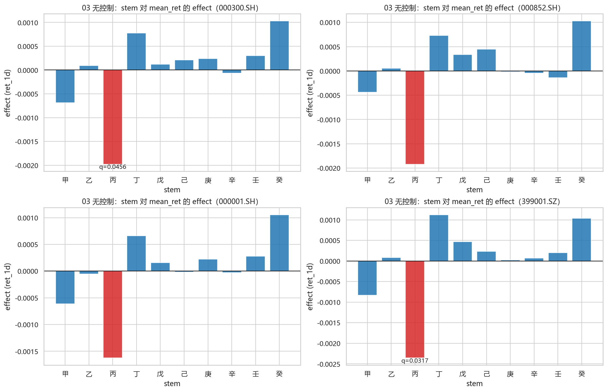

显著项（q<=阈值；若为空表示未通过阈值）：
| ts_code | group_value | effect | p_value | q_value | n |
| --- | --- | --- | --- | --- | --- |
| 000300.SH | 丙 | -0.00197894 | 0.00456059 | 0.0456059 | 395 |
| 399001.SZ | 丙 | -0.00235634 | 0.00317262 | 0.0317262 | 395 |

全量扫描（每个 group_type×metric 的最小 q；不代表通过阈值）：
| ts_code | group_type | metric | group_value | effect | p_value | q_value | n |
| --- | --- | --- | --- | --- | --- | --- | --- |
| 000001.SH | branch | mean_ret | 辰 | -0.00163287 | 0.0176208 | 0.211449 | 333 |
| 000001.SH | ganzhi_day | mean_ret | 壬子 | 0.00406768 | 0.00475419 | 0.153765 | 66 |
| 000001.SH | stem | mean_ret | 丙 | -0.00162579 | 0.0125633 | 0.125633 | 395 |
| 000001.SH | branch | p_up | 午 | -0.05059 | 0.0758694 | 0.79712 | 326 |
| 000001.SH | ganzhi_day | p_up | 丁亥 | 0.148892 | 0.0174579 | 0.773858 | 64 |
| 000001.SH | stem | p_up | 癸 | 0.0635807 | 0.0126135 | 0.126135 | 387 |
| 000300.SH | branch | mean_ret | 辰 | -0.0014588 | 0.0452045 | 0.422073 | 333 |
| 000300.SH | ganzhi_day | mean_ret | 壬子 | 0.00493667 | 0.00268869 | 0.161321 | 66 |
| 000300.SH | stem | mean_ret | 丙 | -0.00197894 | 0.00456059 | 0.0456059 | 395 |
| 000300.SH | branch | p_up | 午 | -0.0493257 | 0.0764474 | 0.815294 | 326 |
| 000300.SH | ganzhi_day | p_up | 丁亥 | 0.178052 | 0.00553192 | 0.331915 | 64 |
| 000300.SH | stem | p_up | 癸 | 0.0461071 | 0.0750636 | 0.636051 | 387 |
| 000852.SH | branch | mean_ret | 辰 | -0.00165377 | 0.0697612 | 0.575397 | 333 |
| 000852.SH | ganzhi_day | mean_ret | 庚子 | 0.00611922 | 0.0046214 | 0.277284 | 62 |
| 000852.SH | stem | mean_ret | 丙 | -0.00192142 | 0.0274893 | 0.274893 | 395 |
| 000852.SH | branch | p_up | 午 | -0.0449438 | 0.106919 | 0.559709 | 326 |
| 000852.SH | ganzhi_day | p_up | 壬寅 | 0.171474 | 0.00464958 | 0.268099 | 67 |
| 000852.SH | stem | p_up | 癸 | 0.0467874 | 0.0662185 | 0.662185 | 387 |
| 399001.SZ | branch | mean_ret | 辰 | -0.00159473 | 0.0513616 | 0.566985 | 333 |
| 399001.SZ | ganzhi_day | mean_ret | 壬子 | 0.0051202 | 0.00523457 | 0.286066 | 66 |
| 399001.SZ | stem | mean_ret | 丙 | -0.00235634 | 0.00317262 | 0.0317262 | 395 |
| 399001.SZ | branch | p_up | 辰 | -0.0317869 | 0.250269 | 0.946916 | 333 |
| 399001.SZ | ganzhi_day | p_up | 壬寅 | 0.12661 | 0.0498021 | 0.897719 | 67 |
| 399001.SZ | stem | p_up | 丁 | 0.0370197 | 0.155639 | 0.600396 | 389 |

通过阈值的项（q<=阈值）：
| ts_code | group_type | metric | group_value | effect | p_value | q_value | n |
| --- | --- | --- | --- | --- | --- | --- | --- |
| 000300.SH | stem | mean_ret | 丙 | -0.00197894 | 0.00456059 | 0.0456059 | 395 |
| 399001.SZ | stem | mean_ret | 丙 | -0.00235634 | 0.00317262 | 0.0317262 | 395 |

## 稳健性（04）
### 04a 控制变量回归（weekday/month/year）
- 图：`controls_stem_ret_1d_effect_20260214_160139.png`

显著项（q_effect<=阈值；若为空表示未通过阈值）：
| ts_code | group_value | effect | p_value_effect | q_value_effect |
| --- | --- | --- | --- | --- |
| 000300.SH | 丙 | -0.00197054 | 0.00473757 | 0.0473757 |
| 399001.SZ | 丙 | -0.00233952 | 0.00371533 | 0.0371533 |

### 04b 子样本（年份段）
- 图：`subsample_bing_effect_bp_20260214_160139.png`
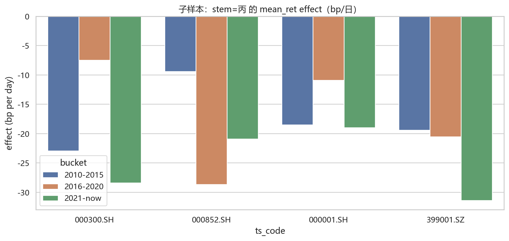

### 04c 置换检验（全局）
> p_empirical 越小表示“存在任意组效应”的证据越强。
| group_col | target | k_groups | t_obs | p_empirical | t_perm_mean | t_perm_p95 | t_perm_p99 | ts_code | n |
| --- | --- | --- | --- | --- | --- | --- | --- | --- | --- |
| stem | ret_1d | 10 | 0.00235634 | 0.024975 | 0.00141042 | 0.00211243 | 0.00260723 | 399001.SZ | 3916 |
| stem | ret_1d | 10 | 0.00197894 | 0.033966 | 0.00124018 | 0.00186038 | 0.00221082 | 000300.SH | 3916 |
| stem | ret_1d | 10 | 0.00162579 | 0.0679321 | 0.00113558 | 0.00168616 | 0.0020473 | 000001.SH | 3916 |
| stem | up | 10 | 0.0635807 | 0.0699301 | 0.0444643 | 0.0669106 | 0.0811353 | 000001.SH | 3916 |
| branch | ret_1d | 12 | 0.00163287 | 0.151848 | 0.00128392 | 0.0018607 | 0.00214632 | 000001.SH | 3916 |
| stem | ret_1d | 10 | 0.00192142 | 0.170829 | 0.00152815 | 0.00228005 | 0.00284558 | 000852.SH | 3916 |
| ganzhi_day | up | 60 | 0.178052 | 0.181818 | 0.157112 | 0.200249 | 0.223779 | 000300.SH | 3916 |
| ganzhi_day | ret_1d | 60 | 0.00611922 | 0.188811 | 0.0054015 | 0.00709203 | 0.00773887 | 000852.SH | 3916 |
| ganzhi_day | ret_1d | 60 | 0.00493667 | 0.1998 | 0.00436669 | 0.00573665 | 0.00663752 | 000300.SH | 3916 |
| ganzhi_day | ret_1d | 60 | 0.00439625 | 0.254745 | 0.00401153 | 0.00531688 | 0.00592349 | 000001.SH | 3916 |
| ganzhi_day | up | 60 | 0.171474 | 0.266733 | 0.156877 | 0.201194 | 0.221443 | 000852.SH | 3916 |
| ganzhi_day | ret_1d | 60 | 0.00527911 | 0.31968 | 0.00499144 | 0.00660502 | 0.00729714 | 399001.SZ | 3916 |
| stem | up | 10 | 0.0467874 | 0.396603 | 0.044768 | 0.0664794 | 0.0823086 | 000852.SH | 3916 |
| branch | ret_1d | 12 | 0.0014588 | 0.40959 | 0.00140085 | 0.00205594 | 0.00237506 | 000300.SH | 3916 |
| stem | up | 10 | 0.0461071 | 0.412587 | 0.0448148 | 0.0689578 | 0.0778934 | 000300.SH | 3916 |
| branch | up | 12 | 0.05059 | 0.456543 | 0.0504682 | 0.0733476 | 0.0874023 | 000001.SH | 3916 |
| branch | ret_1d | 12 | 0.00159473 | 0.487512 | 0.00159455 | 0.00229933 | 0.00272028 | 399001.SZ | 3916 |
| branch | up | 12 | 0.0493257 | 0.502498 | 0.05074 | 0.0738656 | 0.0866089 | 000300.SH | 3916 |
| branch | ret_1d | 12 | 0.00165377 | 0.523477 | 0.00173256 | 0.00253567 | 0.00302321 | 000852.SH | 3916 |
| ganzhi_day | up | 60 | 0.148892 | 0.592408 | 0.156539 | 0.199906 | 0.227017 | 000001.SH | 3916 |

### 04c2 置换检验（控制变量残差）
> 先回归掉 `weekday/month/year`，对 `stem × ret_resid` 做全局置换检验（更保守）。
| group_col | target | k_groups | t_obs | p_empirical | t_perm_mean | t_perm_p95 | t_perm_p99 | ts_code | n | n_perm | seed |
| --- | --- | --- | --- | --- | --- | --- | --- | --- | --- | --- | --- |
| stem | ret_resid | 10 | 0.00233872 | 0.0149925 | 0.00138119 | 0.00208086 | 0.00239037 | 399001.SZ | 3916 | 2000 | 20260214 |
| stem | ret_resid | 10 | 0.00196988 | 0.0244878 | 0.0012148 | 0.00182071 | 0.00213938 | 000300.SH | 3916 | 2000 | 20260214 |
| stem | ret_resid | 10 | 0.00161201 | 0.0604698 | 0.00110997 | 0.0016486 | 0.00194636 | 000001.SH | 3916 | 2000 | 20260214 |
| stem | ret_resid | 10 | 0.00188354 | 0.168416 | 0.00149819 | 0.00221818 | 0.00253348 | 000852.SH | 3916 | 2000 | 20260214 |

### 04d 样本外（walk-forward，按年）
- 图：`walk_forward_bing_oos_diff_20260214_160139.png`

汇总：
| ts_code | n_years | neg_years | neg_ratio | mean_oos_diff | p_value_sign_test |
| --- | --- | --- | --- | --- | --- |
| 000001.SH | 11 | 11 | 1 | -0.00165673 | 0.000976562 |
| 000300.SH | 11 | 10 | 0.909091 | -0.00196126 | 0.0117188 |
| 000852.SH | 11 | 10 | 0.909091 | -0.00237909 | 0.0117188 |
| 399001.SZ | 11 | 11 | 1 | -0.00258351 | 0.000976562 |

### 04e HAC `maxlags` 敏感性（stem=丙）
| ts_code | maxlags | effect | p_value_effect | q_value_effect |
| --- | --- | --- | --- | --- |
| 000001.SH | 0 | -0.00161259 | 0.0130237 | 0.130237 |
| 000001.SH | 1 | -0.00161259 | 0.01348 | 0.1348 |
| 000001.SH | 3 | -0.00161259 | 0.0137752 | 0.137752 |
| 000001.SH | 5 | -0.00161259 | 0.0135686 | 0.135686 |
| 000001.SH | 10 | -0.00161259 | 0.0127733 | 0.127733 |
| 000300.SH | 0 | -0.00197054 | 0.00458441 | 0.0458441 |
| 000300.SH | 1 | -0.00197054 | 0.00481047 | 0.0481047 |
| 000300.SH | 3 | -0.00197054 | 0.00488352 | 0.0488352 |
| 000300.SH | 5 | -0.00197054 | 0.00473757 | 0.0473757 |
| 000300.SH | 10 | -0.00197054 | 0.00445829 | 0.0445829 |
| 000852.SH | 0 | -0.00188421 | 0.0298729 | 0.298729 |
| 000852.SH | 1 | -0.00188421 | 0.0307632 | 0.307632 |
| 000852.SH | 3 | -0.00188421 | 0.0318954 | 0.318954 |
| 000852.SH | 5 | -0.00188421 | 0.0331377 | 0.331377 |
| 000852.SH | 10 | -0.00188421 | 0.0322265 | 0.322265 |
| 399001.SZ | 0 | -0.00233952 | 0.00330847 | 0.0330847 |
| 399001.SZ | 1 | -0.00233952 | 0.00353305 | 0.0353305 |
| 399001.SZ | 3 | -0.00233952 | 0.00367045 | 0.0367045 |
| 399001.SZ | 5 | -0.00233952 | 0.00371533 | 0.0371533 |
| 399001.SZ | 10 | -0.00233952 | 0.00363429 | 0.0363429 |

### 04f block bootstrap（controls 残差；stem=丙）
| ts_code | effect_obs | boot_ci_low | boot_ci_high | p_boot_two_sided |
| --- | --- | --- | --- | --- |
| 000001.SH | -0.00161201 | -0.00277647 | -0.000290677 | 0.018 |
| 000300.SH | -0.00196988 | -0.00327463 | -0.000538659 | 0.002 |
| 000852.SH | -0.00188354 | -0.00364837 | -0.000222465 | 0.03 |
| 399001.SZ | -0.00233872 | -0.0038457 | -0.000789977 | 0.006 |

### 04g 跨指数复现（Meta + OOS）
通过“q_meta + 方向一致 + OOS 稳定”的项：
| group_value | effect_meta | q_meta | n_indices_used | sign_consistent_count | oos_pass_count | pass_q_meta | pass_direction | pass_oos | pass_all |
| --- | --- | --- | --- | --- | --- | --- | --- | --- | --- |
| 丙 | -0.00191764 | 2.59739e-06 | 4 | 4 | 4 | True | True | True | True |

Meta（10 天干全量）：
| group_value | effect_meta | se_meta | z_meta | p_meta | I2 | n_indices_used | sign_consistent_count | q_meta |
| --- | --- | --- | --- | --- | --- | --- | --- | --- |
| 丙 | -0.00191764 | 0.000372318 | -5.15054 | 2.59739e-07 | 0 | 4 | 4 | 2.59739e-06 |
| 癸 | 0.00105439 | 0.000334674 | 3.15049 | 0.00162996 | 0 | 4 | 4 | 0.00814979 |
| 丁 | 0.000797764 | 0.000366841 | 2.17469 | 0.0296536 | 0 | 4 | 4 | 0.0988455 |
| 甲 | -0.000645682 | 0.000338152 | -1.90944 | 0.0562049 | 0 | 4 | 4 | 0.140512 |
| 戊 | 0.000237777 | 0.000346482 | 0.686259 | 0.49255 | 0 | 4 | 4 | 0.866782 |
| 壬 | 0.000208037 | 0.000323421 | 0.643238 | 0.520069 | 0 | 4 | 3 | 0.866782 |
| 己 | 0.00015823 | 0.0003112 | 0.508451 | 0.611137 | 0 | 4 | 3 | 0.871392 |
| 庚 | 0.000134645 | 0.000345936 | 0.389219 | 0.697114 | 0 | 4 | 3 | 0.871392 |
| 乙 | 4.15881e-05 | 0.000349708 | 0.118922 | 0.905337 | 0 | 4 | 3 | 0.92152 |
| 辛 | -3.08784e-05 | 0.000313426 | -0.0985189 | 0.92152 | 0 | 4 | 3 | 0.92152 |

OOS 稳定性（仅展示通过项）：
| ts_code | group_value | n_years | neg_ratio | pos_ratio | match_ratio | p_sign |
| --- | --- | --- | --- | --- | --- | --- |
| 000001.SH | 丙 | 11 | 1 | 0 | 1 | 0.000976562 |
| 000300.SH | 丙 | 11 | 0.909091 | 0.0909091 | 0.909091 | 0.0117188 |
| 000852.SH | 丙 | 11 | 0.909091 | 0.0909091 | 0.909091 | 0.0117188 |
| 399001.SZ | 丙 | 11 | 1 | 0 | 1 | 0.000976562 |

### 04h 候选 stem 深挖（癸/丁：Meta 显著但 OOS 不稳的诊断）
> 本节仅做诊断，不改变“正式结论”筛选规则。
候选 stem：癸，丁

raw OOS：翻符号年份（相对 Meta 方向）：
| stem | ts_code | meta_sign | n_years | pos_years | neg_years | match_ratio_raw | p_sign_raw | flip_years_raw | sign_seq_raw |
| --- | --- | --- | --- | --- | --- | --- | --- | --- | --- |
| 丁 | 000001.SH | 1 | 11 | 7 | 4 | 0.636364 | 0.548828 | 2016,2021,2022,2023 | +-++++---++ |
| 丁 | 000300.SH | 1 | 11 | 7 | 4 | 0.636364 | 0.548828 | 2016,2021,2022,2023 | +-++++---++ |
| 丁 | 000852.SH | 1 | 11 | 7 | 4 | 0.636364 | 0.548828 | 2016,2021,2022,2023 | +-++++---++ |
| 丁 | 399001.SZ | 1 | 11 | 7 | 4 | 0.636364 | 0.548828 | 2016,2021,2022,2023 | +-++++---++ |
| 癸 | 000001.SH | 1 | 11 | 8 | 3 | 0.727273 | 0.226562 | 2015,2017,2019 | -+-+-++++++ |
| 癸 | 000300.SH | 1 | 11 | 8 | 3 | 0.727273 | 0.226562 | 2015,2017,2019 | -+-+-++++++ |
| 癸 | 000852.SH | 1 | 11 | 8 | 3 | 0.727273 | 0.226562 | 2015,2019,2021 | -+++-+-++++ |
| 癸 | 399001.SZ | 1 | 11 | 8 | 3 | 0.727273 | 0.226562 | 2015,2017,2019 | -+-+-++++++ |

controls-only residual OOS：稳定性指标（相对 Meta 方向）：
| ts_code | group_value | n_years | neg_ratio | pos_ratio | match_ratio | p_sign |
| --- | --- | --- | --- | --- | --- | --- |
| 000001.SH | 丁 | 11 | 0.363636 | 0.636364 | 0.636364 | 0.548828 |
| 000300.SH | 丁 | 11 | 0.363636 | 0.636364 | 0.636364 | 0.548828 |
| 000852.SH | 丁 | 11 | 0.363636 | 0.636364 | 0.636364 | 0.548828 |
| 399001.SZ | 丁 | 11 | 0.363636 | 0.636364 | 0.636364 | 0.548828 |
| 000001.SH | 癸 | 11 | 0.272727 | 0.727273 | 0.727273 | 0.226562 |
| 000300.SH | 癸 | 11 | 0.272727 | 0.727273 | 0.727273 | 0.226562 |
| 000852.SH | 癸 | 11 | 0.272727 | 0.727273 | 0.727273 | 0.226562 |
| 399001.SZ | 癸 | 11 | 0.272727 | 0.727273 | 0.727273 | 0.226562 |

断点对比（按年，2020 前后；年份层面置换，仅作提示）：
| stem | ts_code | metric | n_years | n_pre | n_post | mean_pre | mean_post | diff_post_minus_pre | p_perm_year_shuffle |
| --- | --- | --- | --- | --- | --- | --- | --- | --- | --- |
| 丁 | 000001.SH | controls_resid | 11 | 5 | 6 | 0.0032103 | 4.6828e-05 | -0.00316347 | 0.246388 |
| 丁 | 000001.SH | raw | 11 | 5 | 6 | 0.00321624 | 8.61621e-05 | -0.00313008 | 0.247488 |
| 丁 | 000300.SH | controls_resid | 11 | 5 | 6 | 0.00361667 | 0.00028081 | -0.00333586 | 0.245238 |
| 丁 | 000300.SH | raw | 11 | 5 | 6 | 0.00362217 | 0.000313698 | -0.00330847 | 0.237888 |
| 丁 | 000852.SH | controls_resid | 11 | 5 | 6 | 0.00436609 | 0.000240465 | -0.00412562 | 0.231738 |
| 丁 | 000852.SH | raw | 11 | 5 | 6 | 0.00434446 | 0.000303149 | -0.00404131 | 0.246438 |
| 丁 | 399001.SZ | controls_resid | 11 | 5 | 6 | 0.00435654 | 0.000771867 | -0.00358467 | 0.308785 |
| 丁 | 399001.SZ | raw | 11 | 5 | 6 | 0.00435768 | 0.000827612 | -0.00353007 | 0.306885 |
| 癸 | 000001.SH | controls_resid | 11 | 5 | 6 | -0.000200369 | 0.00208857 | 0.00228893 | 0.20149 |
| 癸 | 000001.SH | raw | 11 | 5 | 6 | -0.000172556 | 0.00213155 | 0.00230411 | 0.185541 |
| 癸 | 000300.SH | controls_resid | 11 | 5 | 6 | -0.000640347 | 0.00211172 | 0.00275206 | 0.141343 |
| 癸 | 000300.SH | raw | 11 | 5 | 6 | -0.000616971 | 0.00217018 | 0.00278715 | 0.139743 |
| 癸 | 000852.SH | controls_resid | 11 | 5 | 6 | -0.00133483 | 0.00219952 | 0.00353435 | 0.309485 |
| 癸 | 000852.SH | raw | 11 | 5 | 6 | -0.00129245 | 0.00221898 | 0.00351143 | 0.308485 |
| 癸 | 399001.SZ | controls_resid | 11 | 5 | 6 | -0.00112126 | 0.00206384 | 0.0031851 | 0.211839 |
| 癸 | 399001.SZ | raw | 11 | 5 | 6 | -0.00111263 | 0.00211953 | 0.00323217 | 0.20654 |

训练窗敏感性（controls-only residual；相对 Meta 方向）：
| train_years | group_value | n_indices | median_match_ratio | pass_count |
| --- | --- | --- | --- | --- |
| 3 | 丁 | 4 | 0.653846 | 0 |
| 3 | 丙 | 4 | 0.923077 | 4 |
| 3 | 癸 | 4 | 0.692308 | 0 |
| 5 | 丁 | 4 | 0.636364 | 0 |
| 5 | 丙 | 4 | 0.954545 | 4 |
| 5 | 癸 | 4 | 0.727273 | 0 |
| 7 | 丁 | 4 | 0.666667 | 0 |
| 7 | 丙 | 4 | 1 | 4 |
| 7 | 癸 | 4 | 0.777778 | 0 |

图：raw OOS 跨指数平均（stem=癸）：`candidate_raw_oos_癸_avg_20260214_160139.png`
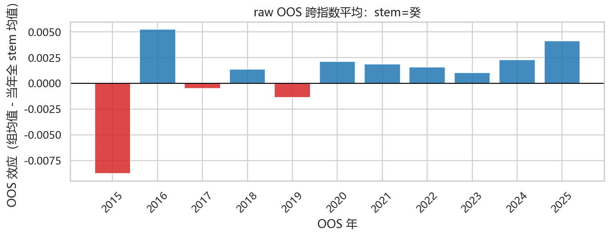

图：raw vs controls OOS（每指数）（stem=癸）
- `candidate_controls_vs_raw_癸_000300.SH_20260214_160139.png`
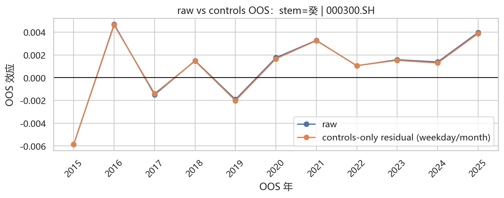
- `candidate_controls_vs_raw_癸_000852.SH_20260214_160139.png`
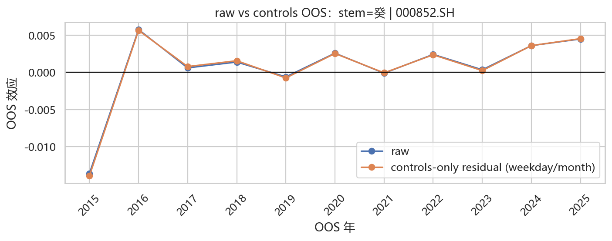
- `candidate_controls_vs_raw_癸_000001.SH_20260214_160139.png`
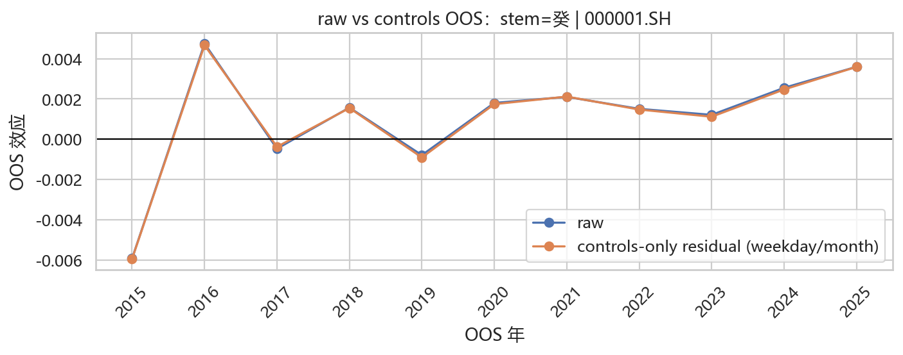
- `candidate_controls_vs_raw_癸_399001.SZ_20260214_160139.png`
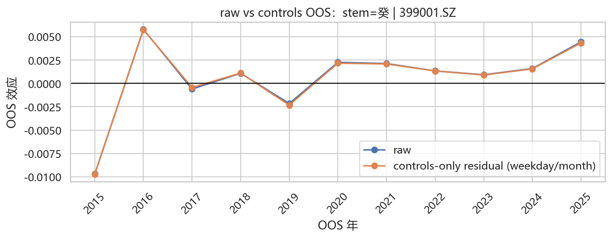

图：raw OOS 跨指数平均（stem=丁）：`candidate_raw_oos_丁_avg_20260214_160139.png`
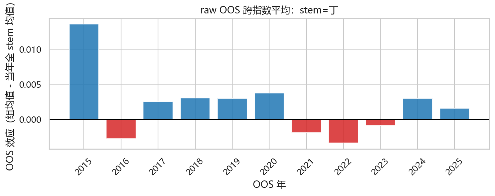

图：raw vs controls OOS（每指数）（stem=丁）
- `candidate_controls_vs_raw_丁_000300.SH_20260214_160139.png`
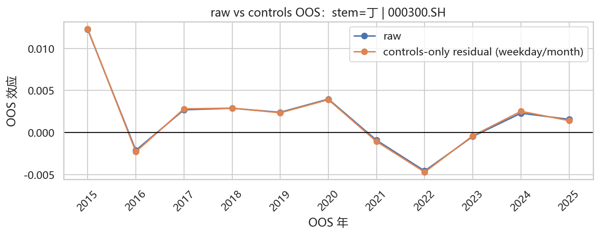
- `candidate_controls_vs_raw_丁_000852.SH_20260214_160139.png`
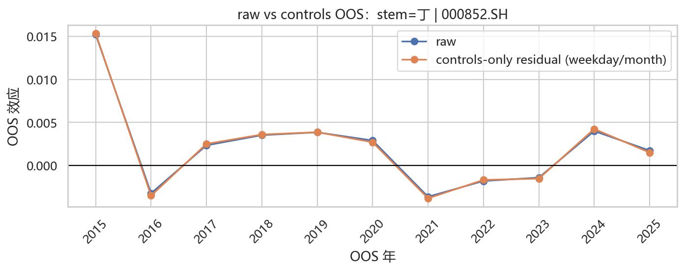
- `candidate_controls_vs_raw_丁_000001.SH_20260214_160139.png`
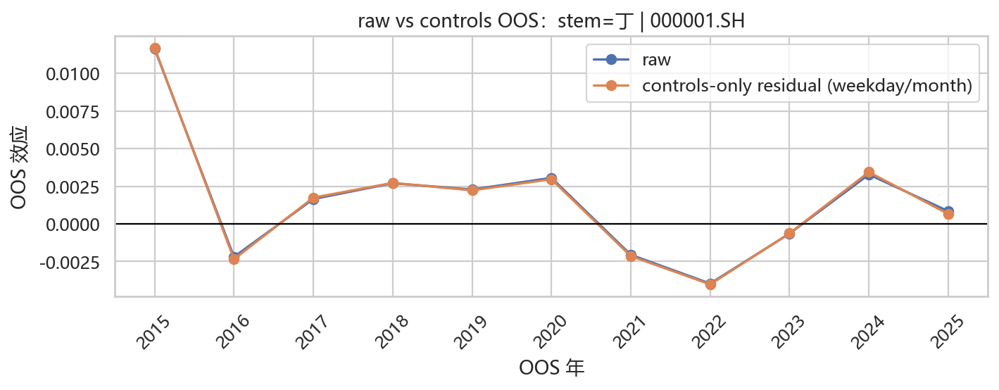
- `candidate_controls_vs_raw_丁_399001.SZ_20260214_160139.png`
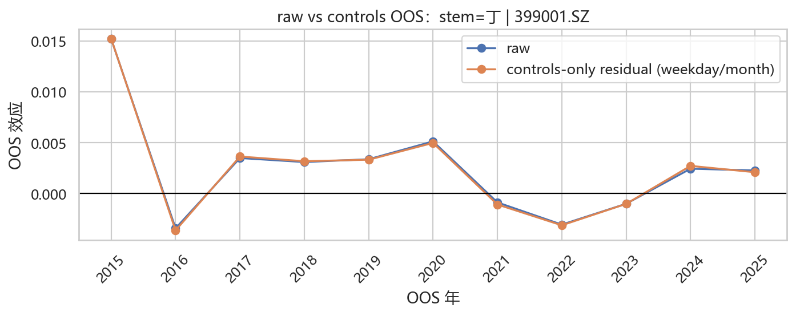

### 04i Phase 2：立春年 year_element 交互（day_group × year_element；全局 gate）
> 说明：采用层级检验（全局 gate → 才看局部 cell），防止在高维 cell 中事后挑显著。
Gate 汇总（跨指数 Fisher 合并 + BH-FDR；仅 3 个 day_group）：
| day_group | k_indices_used | n_pass_p_interaction | min_pass_required | fisher_stat | fisher_df | p_meta_interaction | q_meta_interaction | pass_q | pass_p_count | pass_gate | p_interaction_000001.SH | p_interaction_000300.SH | p_interaction_000852.SH | p_interaction_399001.SZ |
| --- | --- | --- | --- | --- | --- | --- | --- | --- | --- | --- | --- | --- | --- | --- |
| ganzhi_day | 4 | 4 | 3 | 139.357 | 8 | 3.22836e-26 | 9.68508e-26 | True | True | True | 3.49717e-07 | 1.38845e-06 | 7.31929e-12 | 1.54274e-07 |
| branch | 4 | 3 | 3 | 33.7202 | 8 | 4.56532e-05 | 6.84798e-05 | True | True | True | 0.00330653 | 0.00644344 | 0.151191 | 0.0147821 |
| stem | 4 | 0 | 3 | 10.0021 | 8 | 0.264882 | 0.264882 | False | False | False | 0.236708 | 0.149564 | 0.696746 | 0.272878 |

局部 heatmap（ganzhi_day×year_element；bp/日；仅 gate 通过展示）：`phase2_interaction_heatmap_ganzhi_day_20260214_160139.png`
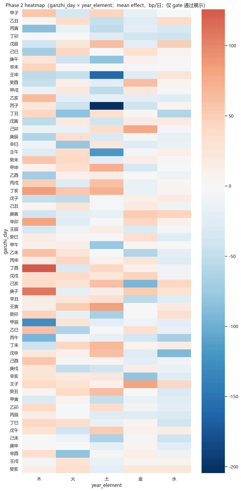

候选（Exploratory；方向一致≥75%；按跨指数平均效应绝对值排序；已落盘 `interaction_candidates_ganzhi_day_ret_1d.csv`）：
| group_value | year_element | k_used | mean_effect | mean_effect_bp | sign_consistent_count | n_median | n_min | min_sign_required | pass_direction | abs_mean_bp |
| --- | --- | --- | --- | --- | --- | --- | --- | --- | --- | --- |
| 丙子 | 土 | 4 | -0.0204596 | -204.596 | 4 | 9 | 9 | 3 | True | 204.596 |
| 壬申 | 土 | 4 | -0.0159467 | -159.467 | 4 | 6 | 6 | 3 | True | 159.467 |
| 甲辰 | 木 | 4 | -0.0126113 | -126.113 | 4 | 14 | 14 | 3 | True | 126.113 |
| 丁酉 | 木 | 4 | 0.0125865 | 125.865 | 4 | 17 | 17 | 3 | True | 125.865 |
| 壬午 | 土 | 4 | -0.0118343 | -118.343 | 4 | 9 | 9 | 3 | True | 118.343 |
| 庚子 | 木 | 4 | 0.0108467 | 108.467 | 4 | 16 | 16 | 3 | True | 108.467 |
| 丙午 | 木 | 4 | -0.00940323 | -94.0323 | 4 | 15 | 15 | 3 | True | 94.0323 |
| 己亥 | 金 | 4 | -0.00935054 | -93.5054 | 4 | 16 | 16 | 3 | True | 93.5054 |
| 戊申 | 水 | 4 | -0.00910304 | -91.0304 | 4 | 15 | 15 | 3 | True | 91.0304 |
| 丙寅 | 木 | 4 | -0.00857006 | -85.7006 | 4 | 16 | 16 | 3 | True | 85.7006 |
| 丁亥 | 木 | 4 | 0.00849721 | 84.9721 | 4 | 18 | 18 | 3 | True | 84.9721 |
| 壬寅 | 土 | 4 | 0.00835006 | 83.5006 | 4 | 9 | 9 | 3 | True | 83.5006 |
| 丁丑 | 火 | 4 | -0.00833602 | -83.3602 | 4 | 9 | 9 | 3 | True | 83.3602 |
| 辛卯 | 木 | 4 | 0.00830976 | 83.0976 | 4 | 17 | 17 | 3 | True | 83.0976 |
| 庚午 | 土 | 4 | -0.00821806 | -82.1806 | 4 | 9 | 9 | 3 | True | 82.1806 |
| 辛酉 | 火 | 4 | -0.00821286 | -82.1286 | 4 | 6 | 6 | 3 | True | 82.1286 |
| 辛亥 | 金 | 4 | -0.00803173 | -80.3173 | 4 | 16 | 16 | 3 | True | 80.3173 |
| 壬子 | 金 | 4 | 0.00801455 | 80.1455 | 4 | 16 | 16 | 3 | True | 80.1455 |
| 辛巳 | 火 | 4 | -0.0078115 | -78.115 | 4 | 9 | 9 | 3 | True | 78.115 |
| 己卯 | 金 | 4 | 0.00781097 | 78.1097 | 4 | 17 | 17 | 3 | True | 78.1097 |

> 注：仅展示前 20 行（共 269 行）。

局部 heatmap（branch×year_element；bp/日；仅 gate 通过展示）：`phase2_interaction_heatmap_branch_20260214_160139.png`
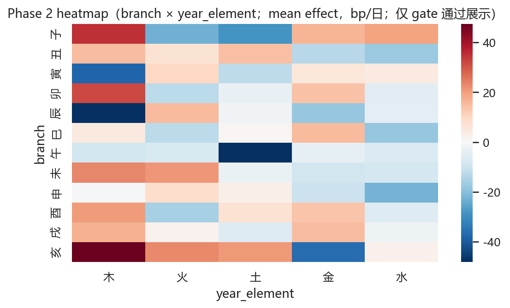

候选（Exploratory；方向一致≥75%；按跨指数平均效应绝对值排序；已落盘 `interaction_candidates_branch_ret_1d.csv`）：
| group_value | year_element | k_used | mean_effect | mean_effect_bp | sign_consistent_count | n_median | n_min | min_sign_required | pass_direction | abs_mean_bp |
| --- | --- | --- | --- | --- | --- | --- | --- | --- | --- | --- |
| 午 | 土 | 4 | -0.00481383 | -48.1383 | 4 | 44 | 44 | 3 | True | 48.1383 |
| 亥 | 木 | 4 | 0.0047531 | 47.531 | 4 | 80 | 80 | 3 | True | 47.531 |
| 辰 | 木 | 4 | -0.00475264 | -47.5264 | 4 | 82 | 82 | 3 | True | 47.5264 |
| 寅 | 木 | 4 | -0.00381815 | -38.1815 | 4 | 83 | 83 | 3 | True | 38.1815 |
| 亥 | 金 | 4 | -0.00368226 | -36.8226 | 4 | 78 | 78 | 3 | True | 36.8226 |
| 子 | 木 | 4 | 0.00351793 | 35.1793 | 4 | 83 | 83 | 3 | True | 35.1793 |
| 卯 | 木 | 4 | 0.00315863 | 31.5863 | 4 | 81 | 81 | 3 | True | 31.5863 |
| 子 | 土 | 4 | -0.00284331 | -28.4331 | 4 | 44 | 44 | 3 | True | 28.4331 |
| 未 | 木 | 4 | 0.00235962 | 23.5962 | 4 | 81 | 81 | 3 | True | 23.5962 |
| 亥 | 火 | 4 | 0.00230738 | 23.0738 | 4 | 42 | 42 | 3 | True | 23.0738 |
| 子 | 火 | 4 | -0.00229232 | -22.9232 | 4 | 40 | 40 | 3 | True | 22.9232 |
| 申 | 水 | 4 | -0.00224361 | -22.4361 | 4 | 78 | 78 | 3 | True | 22.4361 |
| 未 | 火 | 4 | 0.0020998 | 20.998 | 4 | 41 | 41 | 3 | True | 20.998 |
| 亥 | 土 | 4 | 0.00208638 | 20.8638 | 4 | 42 | 42 | 3 | True | 20.8638 |
| 酉 | 木 | 4 | 0.00204395 | 20.4395 | 4 | 83 | 83 | 3 | True | 20.4395 |
| 子 | 水 | 4 | 0.00193415 | 19.3415 | 4 | 80 | 80 | 3 | True | 19.3415 |
| 巳 | 水 | 4 | -0.0018431 | -18.431 | 4 | 80 | 80 | 3 | True | 18.431 |
| 辰 | 金 | 4 | -0.00184042 | -18.4042 | 4 | 84 | 84 | 3 | True | 18.4042 |
| 丑 | 水 | 4 | -0.00177846 | -17.7846 | 4 | 82 | 82 | 3 | True | 17.7846 |
| 戌 | 木 | 4 | 0.00171967 | 17.1967 | 4 | 78 | 78 | 3 | True | 17.1967 |

> 注：仅展示前 20 行（共 58 行）。

## 风险提示与下一步
- 多重比较与数据窥探：务必坚持 q 值阈值，并优先看跨指数一致性与样本外。
- 序列相关：已补充 HAC `maxlags` 敏感性 + block bootstrap（见 04e/04f），仍建议根据机器资源增加次数做复核。
- 更保守的稳健性：已在 controls 残差上做全局置换检验（见 04c2）。
